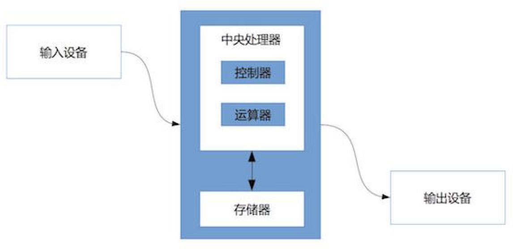
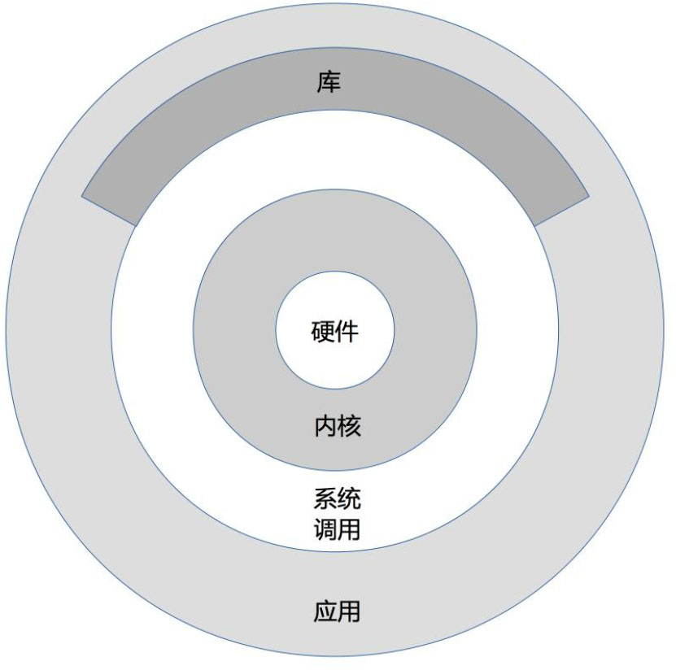

# 1.1 从计算机到编程

人能运算和记忆，但更了不起的是善于借用工具。人类很早就开始利用方法和工具，辅助计算和记忆这样高度复杂的认知活动。古人用给绳子打结的方式来记录圈养的牛羊，我们的祖先很早就能以眼花缭乱的速度使用算盘。随着近代工业化的发展，社会对计算的需求越来越强烈。收税需要计算，造机器需要计算，开挖运河也需要计算。新的计算工具不断出现。利用对数原理，人们制造出计算尺。计算尺可以平行移动尺子来计算乘除法。19世纪的英国人巴贝奇设计了一台机器，用齿轮的组合来进行高精度的计算，隐隐预示着机器计算的到来。20世纪初有了机电式的计算机器。电动马达驱动变档齿轮“咯吱”转动，直到得到计算结果。

二战期间，战争刺激了社会的计算需求。武器设计需要计算，比如坦克的设计、潜艇的外形、弹道的轨迹。社会的军事化管理需要计算，比如火车调度、资源调配、人口动员。至于导弹和核弹这样的高科技项目，更需要海量的计算。美国研制原子弹的曼哈顿计划，除了使用IBM的计算机器外，还雇佣了许多女孩子进行手工运算。计算本身甚至可以成为武器。电影《模仿游戏》就讲述了英国数学家阿兰·图灵（Alan
Mathison
Turing）破解德国传奇密码机的故事。图灵的主要工具，就是机电式的计算机器。值得一提的是，正是这位图灵，提出了通用计算机的理论概念，为未来的计算机发展做好了理论准备。现在，计算机学科的最高奖项就以图灵命名，以纪念他的伟大贡献。德国工程师康拉德·楚泽（Konrad
Zuse）发明的Z3计算机能编写程序。这看起来已经是一台现代计算机的雏形了。

计算工具的发展是渐进的。不过历史把第一台计算机的桂冠颁给了战后宾夕法尼亚大学研制的埃尼阿克（ENIAC，Electronic
Numerical Integrator And
Computer）。埃尼阿克借鉴了前任的经验，远非横空出世的奇迹。但它最重要的意义，是向人们展示了高速运算的可能性。首先它是一台符合图灵标准的通用计算机，能通过编程来执行多样的计算任务。其次，与机电式计算机器不同，埃尼阿克大量使用真空管，从而能快速运算。埃尼阿克的计算速度比之前的机电型机器提高了一千倍，这是一次革命性的飞跃。因此，即便计算辅助工具同样历史悠久，但人们仍认为埃尼阿克引领了一个新的时代—计算机时代。

从埃尼阿克开始，计算机经历了迅猛的发展。计算机所采用的主要元件，从真空管变成大规模集成电路。计算机的运算性能，每一两年的时间就会翻倍。但计算机的大体结构，都采用了冯·诺依曼体系。这一体系是长期演化的结果，但冯·诺依曼进行了很好的总结。按照冯·诺依曼的设计，计算机采用二进制运算，包括控制器、运算器、存储器、输入设备和输出设备五个部分，如图1-1所示。五个部分相互配合，执行特定的操作，即指令。这五个部分各有分工。

图1-1　冯·诺依曼结构

1. **控制器：** 计算机的指挥部，管理计算机其他部分的工作，决定执行指令的顺序，控制不同部件之间的数据交流。
2. **运算器：** 顾名思义，这是计算机中进行运算的部件。除加减乘除之类的算数运算外，还能进行与、或、非之类的逻辑运算。运算器与控制器一起构成了中央处理器（CPU，Central Processing Unit）。
3. **存储器：** 存储信息的部件。冯·诺依曼根据自己在曼哈顿工程中的经验，提出了存储器不但要记录数据，还要记录所要执行的程序。
4. **输入设备：** 向计算机输入信息的设备，如键盘、鼠标、摄像头等。
5. **输出设备：** 计算机向外输出信息的设备，如显示屏、打印机、音响等。

人们最常想到的计算机是台式机和笔记本电脑。其实，计算机还存在于智能手机、汽车、家电等多种设备中。但无论外形如何多变，这些计算机都沿袭了冯·诺依曼结构。不过在具体细节上，计算机之间又有很大的差别。有的计算机使用了多级缓存，有的计算机只有键盘没有鼠标，有的计算机用磁带存储。计算机的硬件是一门很庞杂的学问。幸运的是，计算机用户大多不需要和硬件直接打交道。这一点是**操作系统**（Operating System）的功劳。

操作系统是运行在计算机上的一套软件，负责管理计算机的软硬件资源。有的时候我们请人修电脑，他可能会说“电脑需要重装一下”。这个“重装”，就是重新安装操作系统的意思。无论是微软的Windows，还是苹果的iOS，都属于操作系统。我们编程时，大多数时候都是通过操作系统这个“中间商”来和硬件打交道的。操作系统提供了一套**系统调用**（System
Call），如图1-2所示，规定了操作系统支持哪些操作。当调用某个系统调用时，计算机会执行对应的操作。这就像是按下钢琴上的一个键，钢琴就会发出对应的音律一样。系统调用提供的功能非常基础，有时调用起来很麻烦。操作系统因此定义一些**库函数**（Library
Routine），将系统调用组合成特定的功能，如同几个音律组成的和弦。所谓的编程，就是用这些音律和和弦，来组成一首美妙的音乐。

图1-2　硬件、操作系统和应用程序的关系

