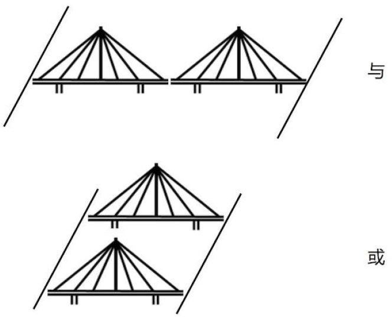

# 2.1 计算机会算术

### 1．数值运算

既然名为“计算机”，那么数学计算自然是计算机的基本功。Python中的运算功能简单且符合直觉。打开Python命令行，输入如下的数值运算，立刻就能进行运算：

------------------------------------------------------------------------

    >>>1 + 9            # 加法。结果为10
    >>>1.3 – 4          # 减法。结果为-2.7
    >>>3*5              # 乘法。结果为15
    >>>4.5/1.5          # 除法。结果为3.0
    >>>3**2             # 乘方，即求3的二次方。结果为9    
    >>>10%3             # 求余数，就求10除以3的余数。结果为1

------------------------------------------------------------------------

有了这些基础运算后，我们就可以像用一个计算器一样使用Python。以买房为例。一套房产的价格为86万元，购买时需要付15%的税，此外还要向银行支付20%的首付。那么我们可以用下面代码计算出需要准备的现金：

------------------------------------------------------------------------

    >>>860000*(0.15 + 0.2)  # 结果为301000.0，即30万1千元

------------------------------------------------------------------------

除了常见的数值运算，字符串也能进行加法运算。其效果是把两个字符串连成一个字符串：

------------------------------------------------------------------------

    >>>"Vamei say:" + "Hello World"  # 连接成"Vamei say:Hello World!"

------------------------------------------------------------------------

一个字符串还能和一个整数进行乘法运算：

------------------------------------------------------------------------

    >>>"Vamei"*2                      # 结果为"VameiVamei"

------------------------------------------------------------------------

一个字符串与一个整数 *n* 相乘的话，会把该字符串重复 *n* 次。

### 2．逻辑运算

除了进行数值运算外，计算机还能进行逻辑运算。如果玩过杀人游戏，或者喜欢侦探小说，那么就很容易理解逻辑。就好像侦探福尔摩斯一样，我们用逻辑去判断一个说法的真假。一个假设性的说法被称为命题，比如说“玩家甲是杀手”。逻辑的任务就是找出命题的真假。

第1章中已经提到，计算机采用了二进制，即用0和1来记录数据。计算机之所以采用二进制，是有技术上的原因。许多组成计算机的原件，都只能表达两个状态，比如电路的开和关、或者电压的高和低。这样造出的系统也相对稳定。如果使用十进制，那么某些计算机原件就要有10个状态，比如把电压分成十个档。那样的话，系统就会变得复杂且容易出错。在二进制体系下，可以用1和0来代表“真”和“假”两种状态。在Python中，我们使用True和False两个关键字来表示真假。True和False这样的数据被称为**布尔值**（Boolean）。

有的时候，我们需要进一步的逻辑运算，从而判断复杂命题的真假。比如第一轮时我知道了“玩家甲不是杀手”为真，第二轮我知道了“玩家乙不是杀手”也是真。那么在第三轮时，如果有人说“玩家甲不是杀手，而且玩家乙也不是杀手”，那么这个人就是在说真话。用“而且”连接起来的两个命题分别为真，那么整体命题就是真。无形中，我们进行了一次“与”的逻辑运算。在“与”运算中，两个子命题必须都为真时，用“与”连接起来的复合命题才是真。“与”运算就像是接连的两座桥，必须两座桥都通畅，才能过河，如图2-1所示。以“中国在亚洲，而且英国也在亚洲”这个命题为例。“英国在亚洲”这个命题是假的，所以整个命题就是假的。在Python中，我们用and来表示“与”的逻辑运算。

------------------------------------------------------------------------

    >>>True and True    # 结果为True
    >>>False and True   # 结果为False
    >>>False and False  # 结果为False

------------------------------------------------------------------------

图2-1　“与”和“或”运算

我们还可以用“或者”把两个命题复合在一起。与咄咄逼人的“而且”关系相比，“或者”显得更加谦逊。比如在“中国在亚洲，或者英国在亚洲”这个说法中，说话的人就给自己留了余地。由于这句话的前一半是对的，所以整个命题就是真的。“或者”就对应了“或”逻辑运算。在“或”运算中，只要有一个命题为真，那么用“或”连接起来的复合命题就是真。“或”运算就像并行跨过河的两座桥，任意一座通畅，就能让行人过河。

Python用or来进行“或”的逻辑运算。

------------------------------------------------------------------------

    >>>True or True   # 结果为True
    >>>True or False  # 结果为True
    >>>False or False # 结果为False

------------------------------------------------------------------------

最后，还有一种称为非的逻辑运算，其实就是对一个命题求反。比如“甲不是杀手”为真，那么“甲是杀手”这个反命题就是假。Python使用not这个关键字来表示非运算，比如：

------------------------------------------------------------------------

    >>>not True  # 结果为False

------------------------------------------------------------------------

### 3．判断表达式

上面的逻辑运算看起来似乎只是些生活经验，完全不需要计算机这样的复杂工具。加入判断表达式之后，逻辑运算方能真正显示出它的威力。

判断表达式其实就是用数学形式写出来的命题。比如“1等于1”，写在Python里就是：

------------------------------------------------------------------------

    >>>1 == 1    # 结果为True

------------------------------------------------------------------------

符号==表示了相等的关系。此外，还有其他的判断运算符：

------------------------------------------------------------------------

    >>>8.0 != 8.0               # !=, 不等于
    >>>4 < 5                   # <, 小于
    >>>3 <= 3                  # <=, 小于或等于
    >>>4 > 5                   # >, 大于
    >>>4 >= 0                  # >=, 大于等于

------------------------------------------------------------------------

这些判断表达式都很简单。即使不借助Python，也能很快在头脑中得出它们的真假。但如果把数值运算、逻辑运算和判断表达式放在一起，就能体现出计算机的优势了。还是用房贷的例子，房产价格86万元，税率15%，首付20%。假如我手里有40万元的现金。出于税务原因，我还希望自己付的税款低于13万元，那么是否还可以买这套房子？这个问题可以借用Python进行计算。

------------------------------------------------------------------------

    >>>860000*(0.15 + 0.2) <= 400000 and 860000*0.15 < 130000

------------------------------------------------------------------------

答案是True，可以买房！

### 4．运算优先级

如果一个表达式中出现多个运算符，就要考虑运算优先级的问题。不同的运算符号优先级不同。运算符可以按照优先级先后归为：

------------------------------------------------------------------------

    乘方：**
    乘除：*   /
    加减：+   -
    判断：==   >>=   <<=
    逻辑：!   and   or

------------------------------------------------------------------------

如果是相同优先级的运算符，那么Python会按照从左向右的顺序进行运算，比如：

------------------------------------------------------------------------

    >>>4 + 2 - 1         # 先执行加法，再执行减法。结果为5

------------------------------------------------------------------------

如果有优先级高的运算符，Python会打破从左向右的默认次序，先执行优先级高的运算，比如：

------------------------------------------------------------------------

    >>>4 + 2*2         # 先执行乘法，再执行加法。结果为8

------------------------------------------------------------------------

括号会打破运算优先级。如果有括号存在，会先进行括号中的运算：

------------------------------------------------------------------------

    >>>(4 + 2)*2         # 先执行加法，再执行乘法。结果为12

------------------------------------------------------------------------
