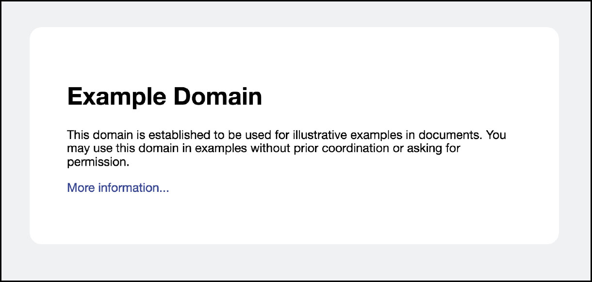

# 5.4 Python有网瘾

### 1．HTTP通信简介

通信是一件奇妙的事情。它让信息在不同的个体间传递。动物们散发着化学元素，传递着求偶信息。人则说着甜言蜜语，向情人表达爱意。猎人们吹着口哨，悄悄地围拢猎物。服务生则大声地向后厨吆喝，要加两套炸鸡和啤酒。红绿灯指挥着交通，电视上播放着广告，法老的金字塔刻着禁止进入的诅咒。有了通信，每个人都和周围的世界连接。在通信这个神秘的过程中，参与通信的个体总要遵守特定的**协议**（Protocol）。在日常交谈中，我们无形中使用约定俗成的语法。如果两个人使用不同的语法，那么就是以不同的协议来交流，最终会不知所云。

计算机之间的通信就是在不同的计算机间传递信息。所以，计算机通信也要遵循通信协议。为了多层次地实现全球互联网通信，计算机通信也有一套多层次的协议体系。HTTP协议是最常见的一种网络协议。它的全名是the Hypertext Transfer Protocol，即超文本传输协议。HTTP协议能实现文件，特别是超文本文件的传输。在互联网时代，它是应用最广的互联网协议之一。事实上，当我们访问一个网址时，通常会在浏览器中输入http打头的网址，如http://www.example.com。这里的http字样，说的就是要用HTTP协议访问相应网站。

HTTP的工作方式类似于快餐点单：

1）请求（request）：顾客向服务员提出请求“来个鸡腿汉堡”。

2）回复（response）：服务员根据情况，回应顾客的请求。

根据情况不同，服务员的回应可能有很多种，比如：

-   服务员准备鸡腿汉堡，将鸡腿汉堡交给顾客。（一切OK）
-   服务员发现自己工作在甜品站。他让顾客前往正式柜台点单。（重新定向）
-   服务员告诉顾客鸡腿汉堡没有了。(无法找到)

交易结束后，服务员就将刚才的交易抛到脑后，准备服务下一位顾客。

图5-1 HTTP服务器

计算机发出请求会遵照下面的格式：

------------------------------------------------------------------------

    GET /index.html HTTP/1.1
    Host: www.example.com

------------------------------------------------------------------------

在起始行中，有三段信息:

-   GET方法。用于说明想要服务器执行的操作。
-   /index.html 资源的路径。这里指向服务器上的index.html文件。
-   HTTP/1.1协议的版本。HTTP第一个广泛使用的版本是1.0，当前版本为1.1。

早期的HTTP协议只有GET方法。遵从HTTP协议，服务器接收到GET请求后，会将特定资源传送给客户。这类似于客户点单，并获得汉堡的过程。GET方法之外，最常用的是POST方法。它用于从客户端向服务器提交数据，请求的后面会附加上要提交的数据。服务器会对POST方法提交的数据进行一定的处理。样例请求中有一行头信息。这个头信息的类型是Host，说明了想要访问的服务器的地址。

服务器在接收到请求之后，会根据程序，生成对应于该请求的回复，比如：

------------------------------------------------------------------------

    HTTP/1.1 200 OK
    Content-type: text/plain
    Content-length: 12

    Hello World!

------------------------------------------------------------------------

回复的起始行包含三段信息：

-   HTTP/1.1：协议版本
-   200：状态码（status code）
-   OK：状态描述

OK是对状态码200的文字描述，它只是为了便于人类的阅读。电脑只关心三位的状态码（Status
Code），即这里的200。200表示一切OK，资源正常返回。状态码代表了服务器回应的类型。其他常见的状态码还有很多，例如：

-   302，重新定向（Redirect）：我这里没有你想要的资源，但我知道另一个地方xxx有，你可以去那里找。
-   404，无法找到（Not Found）：我找不到你想要的资源，无能为力。

下一行Content-type说明了主体所包含的资源的类型。根据类型的不同，客户端可以启动不同的处理程序（比如显示图像文件、播放声音文件等）。下面是一些常见的资源：

-   text/plain：普通文本
-   text/html：HTML文本
-   image/jpeg：jpeg图片
-   image/gif：gif图片

Content-length说明了主体部分的长度，以字节（byte）为单位。

剩下的是回复的主体部分，包含了主要的文本数据。这里是普通类型的一段文本，即：

------------------------------------------------------------------------

    Hello World!

------------------------------------------------------------------------

通过一次HTTP交易，客户端从服务器那里获得了自己请求的资源，即这里的文本。上面是对HTTP协议工作过程的一个简要介绍，省略了很多细节。以此为基础，我们可以看看Python是如何进行HTTP通信的。

### 2．http.client包

Python标准库中的http.client包可用于发出HTTP请求。在上一节中我们已经看到，HTTP请求最重要的一些信息是主机地址、请求方法和资源路径。只要明确这些信息，再加上http.client包的帮助，就可以发出HTTP请求了。

------------------------------------------------------------------------

    import http.client

    conn      = http.client.HTTPConnection("www.example.com") # 主机地址
    conn.request("GET", "/")             # 请求方法和资源路径
    response = conn.getresponse()        # 获得回复

    print(response.status, response.reason)# 回复的状态码和状态描述
    content = response.read()              # 回复的主体内容
    print(content)

------------------------------------------------------------------------

如果网络正常，那么上面的程序将访问网址，并获得对应位置的超文本文件。在浏览器中，这个超文本文件显示为图5-2所示内容。

图5-2　超文本文件显示的内容
