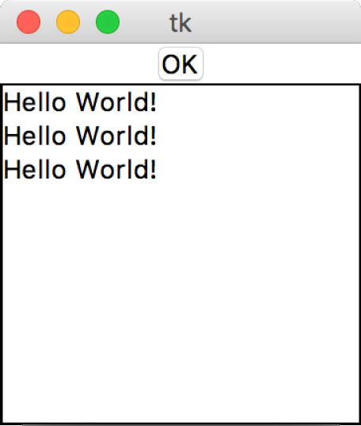

# 7.2 被解放的函数

### 1．函数作为参数和返回值

在函数式编程中，函数是第一级对象。所谓“第一级对象”，即函数能像普通对象一样使用。因此，函数的使用变得更加自由。对于“一切皆对象”的Python来说，这是自然而然的结果。既然如此，那么函数可以像一个普通对象一样，成为其他函数的参数。比如下面的程序，函数就充当了参数：

------------------------------------------------------------------------

    def square_sum(a, b):
        return a**2 + b**2

    def cubic_sum(a, b):
        return a**3 + b**3

    def argument_demo(f, a, b):
        return f(a, b)

    print(argument_demo(square_sum, 3, 5))        # 打印34
    print(argument_demo(cubic_sum, 3, 5))         # 打印152

------------------------------------------------------------------------

函数argument\_demo()的第一个参数f就是一个函数对象。按照位置传参，square\_sum()传递给函数argument\_demo()，对应参数列表中的f。f会在argument\_demo()中被调用。我们可以把其他函数，如cubic\_sum()作为参数传递给argument\_demo()。

很多语言都能把函数作为参数使用，例如C语言。在图形化界面编程时，这样一个作为参数的函数经常起到回调（Callback）的作用。当某个事件发生时，比如界面上的一个按钮被按下，回调函数就会被调用。下面是一个GUI回调的例子：

------------------------------------------------------------------------

    import tkinter as tk

    def callback():
        """
        callback function for button click
        """
        listbox.insert(tk.END, "Hello World!")

    if __name__ == "__main__":
        master = tk.Tk()

        button = tk.Button(master, text="OK", command=callback)
        button.pack()

        listbox = tk.Listbox(master)
        listbox.pack()

        tk.mainloop()

------------------------------------------------------------------------

Python中内置了tkinter的图形化功能。在上面的程序中，回调函数将在列表栏中插入"Hello
World!"。回调函数作为参数传给按钮的构造器。每当按钮被点击时，回调函数就会被调用，如图7-3所示。

图7-3　回调函数运行结果

### 2．函数作为返回值

既然函数是一个对象，那么它就可以成为另一个函数的返回结果。

------------------------------------------------------------------------

    def line_conf():
        def line(x):
            return 2*x+1
        return line       # return a function object

    my_line = line_conf()
    print(my_line(5))         # 打印11

------------------------------------------------------------------------

上面的代码可以成功运行。line\_conf()的返回结果被赋给line对象。上面的代码将打印11。

在上面的例子中，我们看到了在一个函数内部定义的函数。和函数内部的对象一样，函数对象也有存活范围，也就是函数对象的作用域。Python的缩进形式很容易让我们看到函数对象的作用域。函数对象的作用域与它的def的缩进层级相同。比如下面的代码，我们在line\_conf()函数的隶属范围内定义的函数line()，就只能在line\_conf()的隶属范围内调用。

------------------------------------------------------------------------

    def line_conf():
        def line(x):
            return 2*x+1
        print(line(5))       #作用域内

    if __name__=="__main__":
        line_conf()
        print(line(5))       #作用域外，报错

------------------------------------------------------------------------

函数line()定义了一条直线(y = 2x +
1)。可以看到，在line\_conf()中可以调用line()函数，而在作用域之外调用line()函数将会有下面的错误：

------------------------------------------------------------------------

    NameError: name 'line' is not defined

------------------------------------------------------------------------

说明这已经超出了函数line()的作用域。Python对该函数的调用失败。

### 3．闭包

上面函数中，line()定义嵌套在另一个函数内部。如果函数的定义中引用了外部变量，会发生什么呢？

------------------------------------------------------------------------

    def line_conf():
        b = 15
        def line(x):
            return 2*x+b
        b = 5
        return line                   #返回函数对象

    if __name__ == "__main__":
        my_line = line_conf()
        print(my_line(5))             # 打印15

------------------------------------------------------------------------

可以看到，line()定义的隶属程序块中引用了高层级的变量b。b的定义并不在line()的内部，而是一个外部对象。我们称b为line()的环境变量。尽管b位于line()定义的外部，但当line被函数line\_conf()返回时，还是会带有
b的信息。

一个函数和它的环境变量合在一起，就构成了一个**闭包**（Closure）。上面程序中，b分别在line()定义的前后有两次不同的赋值。上面的代码将打印15，也就是说，line()参照的是值为5的b值。因此，闭包中包含的是内部函数返回时的外部对象的值。

在Python中，所谓的闭包是一个包含有环境变量取值的函数对象。环境变量取值被复制到函数对象的\_\_closure\_\_属性中。比如下面的代码：

------------------------------------------------------------------------

    def line_conf():
        b = 15

        def line(x):
            return 2*x+b
        b = 5
        return line       # 返回函数对象

    if __name__ == "__main__":
        my_line = line_conf()
        print(my_line.__closure__)
        print(my_line.__closure__[0].cell_contents)

------------------------------------------------------------------------

可以看到，my\_line()的\_\_closure\_\_属性中包含了一个元组。这个元组中的每个元素都是cell类型的对象。第一个cell包含的就是整数5，也就是我们返回闭包时的环境变量b的取值。

闭包可以提高代码的可复用性。我们看下面三个函数：

------------------------------------------------------------------------

    def line1(x):
        return x + 1

    def line2(x):
        return 4*x + 1

    def line3(x):
        return 5*x + 10

    def line4(x):
        return -2*x – 6

------------------------------------------------------------------------

如果把上面的程序改为闭包，那么代码就会简单很多：

------------------------------------------------------------------------

    def line_conf(a, b):
        def line(x):
         return a*x + b
    return line

    line1 = line_conf(1, 1)
    line2 = line_conf(4, 5)
    line3 = line_conf(5, 10)
    line4 = line_conf(-2, -6)

------------------------------------------------------------------------

这个例子中，函数line()与环境变量 *a、b* 构成闭包。在创建闭包的时候，我们通过line\_conf()的参数a、b说明直线的参量。这样，我们就能复用同一个闭包，通过代入不同的数据来获得不同的直线函数，如 *y = x*  + 1和 *y = 4x* + 5。闭包实际上创建了一群形式相似的函数。

除了复用代码，闭包还能起到减少函数参数的作用：

------------------------------------------------------------------------

    def curve_closure(a, b, c):
        def curve(x):
            return a*x**2 + b*x + c
        return curve

    curve1 = curve_closure(1, 2, 1)

------------------------------------------------------------------------

函数curve()是一个二次函数。它除了自变量 *x* 外，还有a、b、c三个参数。通过curve\_closure()这个闭包，我们可以预设a、b、c三个参数的值。从而起到减参的效果。

闭包的减参作用对于并行运算来说很有意义。在并行运算的环境下，我们可以让每台电脑负责一个函数，把上一台电脑的输出和下一台电脑的输入串联起来。最终，我们像流水线一样工作，从串联的电脑集群一端输入数据，从另一端输出数据。由于每台电脑只能接收一个输入，所以在串联之前，必须用闭包之类的办法把参数的个数降为1。
